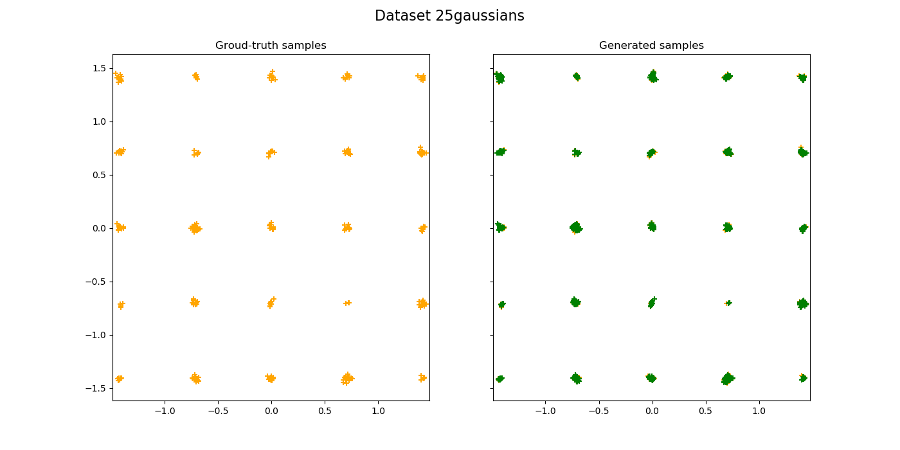
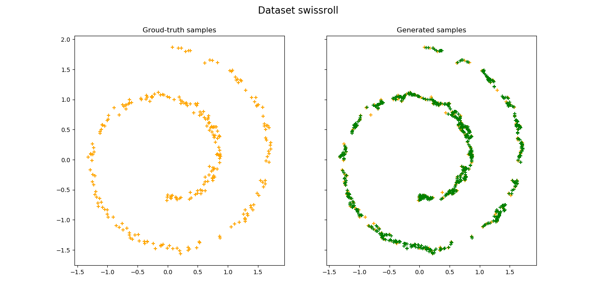

# pyOMT: A Pytorch implementation of Adaptive Monte Carlo Optimal Transport Algorithm
The optimal transport problem arises whenever one wants to transform one distribution to another distribution in a *optimal* way. For example, computing measure preserving maps between surfaces/volumes, matching two histograms, and generating realistic pictures from a given dataset in deep learning. 

The Adaptive Monte Carlo Optimal Transport algorithm tackles potentially high-dimensional semi-discrete OT problems in a scalable way by finding the minimum of a convex energy (i.e. the Brenier potential), which induces the optimal transport map from a continuous distribution to a empirical distribution. The energy is optimized by gradient descent method, and at each iteration, the gradient of the energy is estimated using the Monte Carlo integration. 

## Reference
    @inproceedings{
    An2020AE-OT:,
    title={AE-OT: A NEW GENERATIVE MODEL BASED ON EXTENDED SEMI-DISCRETE OPTIMAL TRANSPORT},
    author={Dongsheng An and Yang Guo and Na Lei and Zhongxuan Luo and Shing-Tung Yau and Xianfeng Gu},
    booktitle={International Conference on Learning Representations},
    year={2020},
    url={[https://openreview.net/pdf?id=HkldyTNYwH]}
    }

## Implementation
Code is developed in [PyTorch](https://pytorch.org/) for better integration with deep learning frameworks. The code is for research purpose only. Please open an issue or email me at *yangg20111 (at) gmail (dot) com* if you have any problem with the code. Suggestions are also highly welcomed. 

## Dependencies
1. Python=3.6 (or above)
2. PyTorch=1.3.0 (or above)
3. NumPy=1.17.4 (or above)
4. Matplotlib=3.1.0 (or above)

## Demos
* Generation examples on simple measures (i.e. toy sets).

  Code:
  > python demo1.py
 
  Results:
 
 
 

* AE-OT model: a generic deep generative framework built on autoencoders.
 

